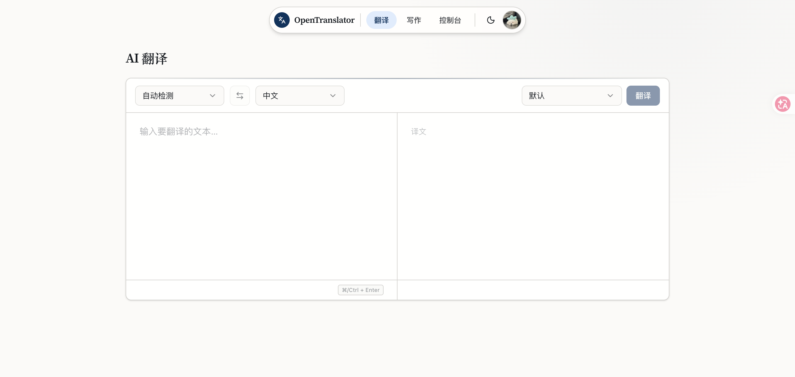
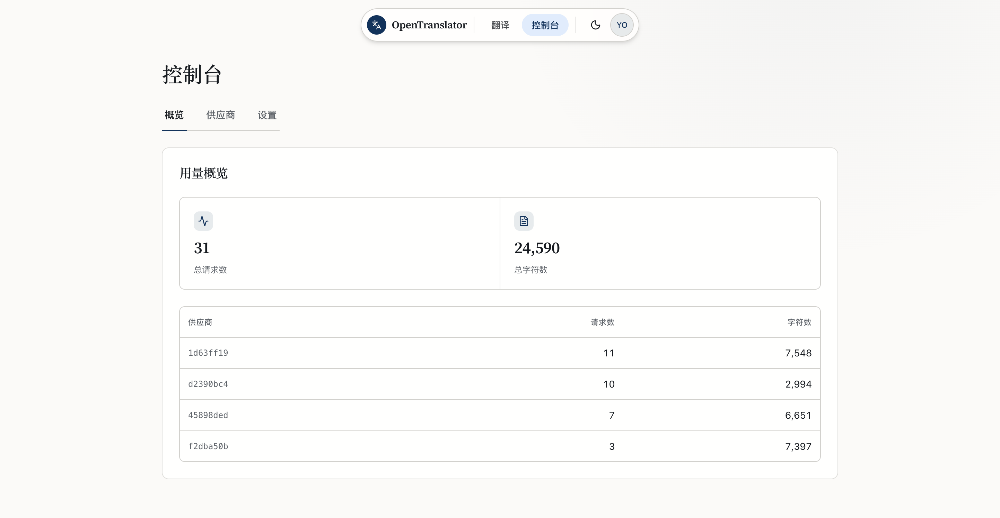
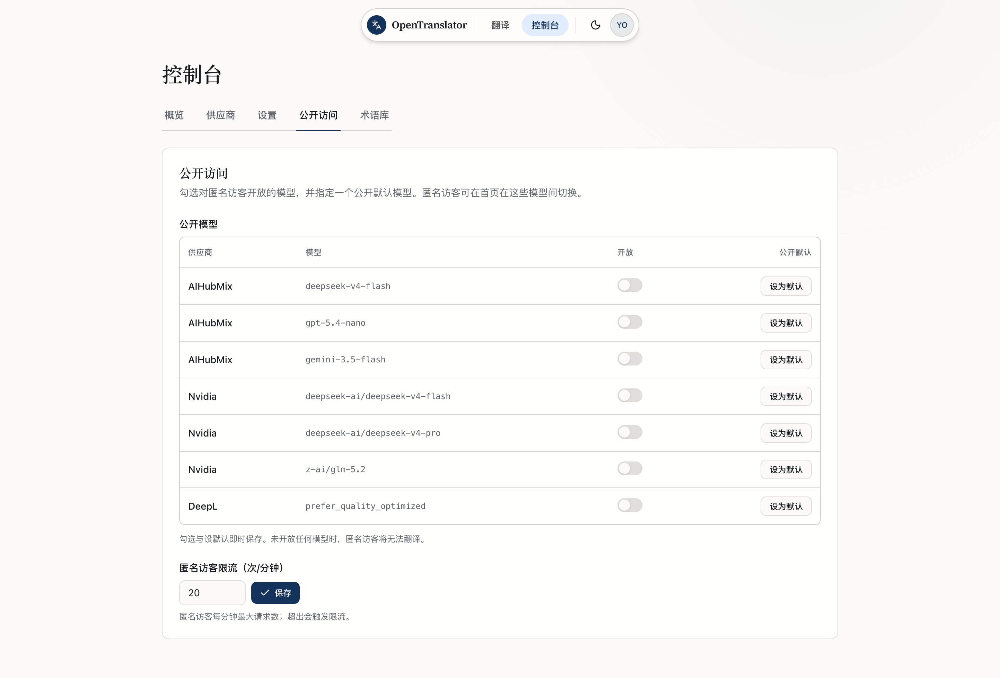
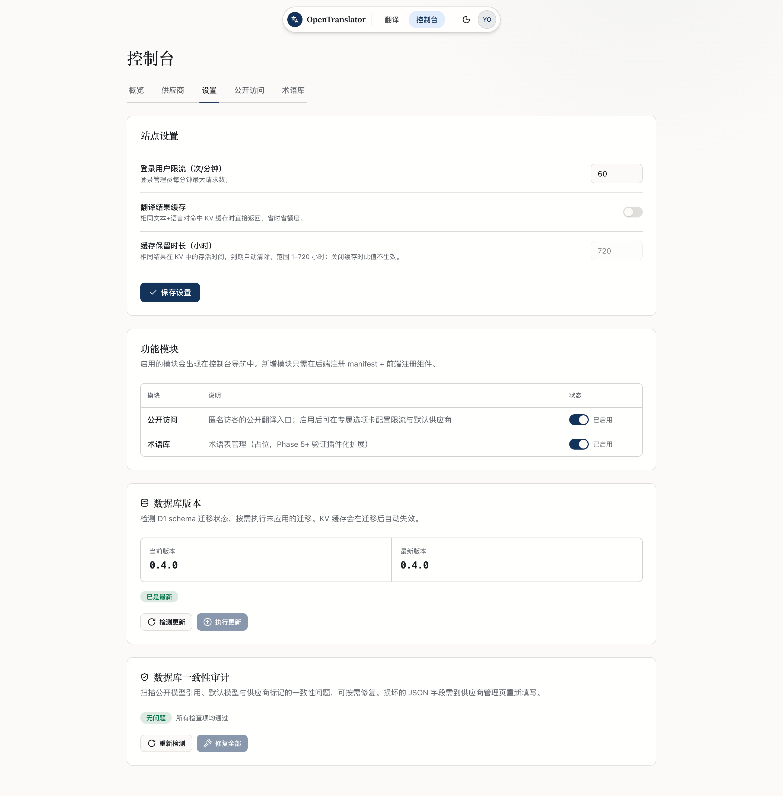
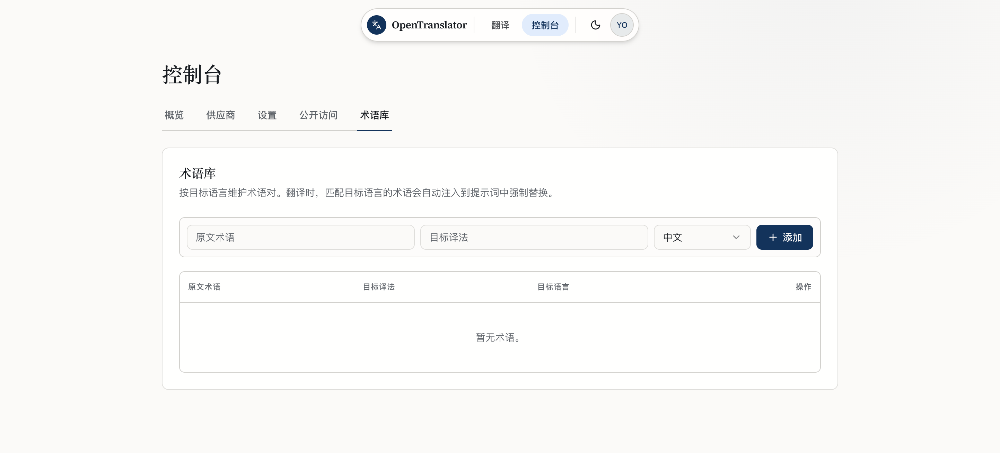

<div align="center">


# OpenTranslator

[](./LICENSE)
[](https://workers.cloudflare.com/)
[](https://react.dev/)
[](https://hono.dev/)

**DeepL 风格的自托管 AI 翻译器 — 多供应商、流式输出、边缘部署**

[特性](#-特性) · [截图](#-截图) · [快速开始](#-快速开始) · [部署](#-部署) · [扩展](#-扩展点) · [路线图](#-路线图)



</div>

---

## ✨ 特性

- **多供应商，随时切换** — OpenAI、Claude、Gemini、DeepSeek、OpenRouter、AIHubMix、Azure OpenAI、自定义 OpenAI 兼容端点，八种 adapter 内置；Dashboard 填 Key 即用，无需改代码。
- **流式翻译** — 译文经 SSE 逐字渲染，跟读 DeepL 的即时手感。
- **插件化扩展** — 供应商走注册表，功能模块走 DB 驱动开关；新增厂商或功能只需加一个 adapter + 一行注册。
- **密钥加密存储** — 供应商 API Key 用 `ENCRYPTION_KEY` 加密后落 D1，明文绝不入库。
- **细粒度限流** — 基于 Durable Object 的每 IP 滑动窗口，公开用户与登录用户分别配额。
- **缓存与统计** — KV 翻译缓存避免重复请求，用量日志落 D1，Dashboard 可视化。
- **术语库** — glossary 作为首个插件化功能，词条自动注入翻译提示词。
- **站点开关** — 一键关闭公开访问，转为纯私有部署。

---

## 📸 截图

### 翻译页

双语对照、语言自动检测、模型切换与快捷键翻译，开箱即用。


### 管理后台

**用量概览** — 总请求数、总字符数与各供应商用量一目了然。



**公开访问** — 勾选匿名访客可用的模型、指定公开默认，并设置匿名限流。



**站点设置** — 登录用户限流、KV 翻译缓存、功能模块开关与数据库维护。



**术语库** — 按目标语言维护术语对，翻译时自动注入提示词强制替换。



---

## 🚀 快速开始

### 前置条件

- Node 22+（pnpm 11 要求 Node 22.13+）、pnpm 11+
- Cloudflare 账号（仅部署时需要；本地开发无需登录）

### 本地开发

```bash
pnpm install
pnpm db:init        # 初始化本地 D1（wrangler dev 用本地 SQLite）
pnpm dev            # 并行启动 web(5173) + api(8787)
```

打开 http://localhost:5173 ，首页会请求 `/api/ping` 验证前后端闭环。Vite 把 `/api` 代理到 `http://localhost:8787`，开发期同源、无需 CORS。本地密钥由 `.dev.vars` 提供（已 gitignore）。

### 首次初始化

1. 打开 `/login`，点击「首次使用？初始化管理员」创建第一个管理员账号。
2. 进入 `/dashboard` → 供应商 → 新增（填入真实 API Key 并勾选「设为公开默认」）。
3. 回到 `/` 即可翻译，译文流式逐字渲染。

---

## ☁️ 部署

> [!NOTE]
> 前端打包进同一个 Worker，`wrangler deploy` 一次发布前后端，同源无需 CORS、无需 `VITE_API_BASE_URL`。部署后访问 `/api/init/<JWT_SECRET>` 即可建表，幂等可重复执行。

<details>
<summary><strong>方式一：Cloudflare Git 连接（推荐，全程网页操作）</strong></summary>

push 到 GitHub → Cloudflare 自动构建部署，无需本地装 wrangler、无需配 CI。

**1. 创建资源（Dashboard）**

- D1：Storage & D1 → Create database → 名字 `opentranslator`
- KV：Workers & Pages → KV → Create namespace → 名字 `SETTINGS_KV`

**2. 连接 Worker（Workers Builds）**

Dashboard → Workers & Pages → Create → Workers → Import a repository → 选仓库，Root directory 填 `/`，Build command 填 `pnpm build`，Deploy command 留空（用默认的 `npx wrangler deploy`）。

创建后进 Worker → Settings：

- **Variables and Secrets** 加两个 secret（32 位以上随机字符串）：
  - `JWT_SECRET`：JWT 签名密钥，同时作为 `/api/init` 凭证
  - `ENCRYPTION_KEY`：供应商 API Key 加密密钥，**务必备份，丢了等于所有密钥作废**
- **Bindings** → Add binding：
  - D1 binding，名字填 `DB` → 选 `opentranslator` 数据库
  - KV binding，名字填 `SETTINGS_KV` → 选刚才的命名空间

**3. 初始化数据库（只做一次）**

部署成功后，浏览器访问 `https://<你的-worker-域名>/api/init/<你的-JWT_SECRET>`，看到 `{"ok":true,...}` 即完成建表。

**4. 初始化数据**

打开 Worker 域名 → `/login` →「首次使用？初始化管理员」→ Dashboard 新增供应商 → 回首页即可翻译。

**5. 后续更新**

改完代码 push 到 `main`，Cloudflare 自动重新构建部署。增量迁移再访问一次 `/api/init/<JWT_SECRET>` 即可。

</details>

<details>
<summary><strong>方式二：本地 wrangler（可选）</strong></summary>

```bash
wrangler login
wrangler d1 create opentranslator            # 用返回的 ID 取消注释 wrangler.toml 里的 d1 段并填入
wrangler kv namespace create SETTINGS_KV      # 同上，取消注释 kv 段并填入
wrangler secret put JWT_SECRET
wrangler secret put ENCRYPTION_KEY
pnpm build                                    # 构建前端到 ./dist
wrangler deploy                               # 一次部署前端 + API
curl https://api.yourdomain.com/api/init/$(grep JWT_SECRET .dev.vars | cut -d= -f2)   # 自动建表
```

</details>

<details>
<summary><strong>配置参考</strong></summary>

| 类型 | 名称 | 说明 |
|---|---|---|
| Secret | `JWT_SECRET` | JWT 签名密钥，32 位以上随机字符串，同时作为 `/api/init` 凭证 |
| Secret | `ENCRYPTION_KEY` | 供应商 API Key 加密密钥，**务必备份** |
| Variable | `ENV` | 环境标识，默认 `development` |
| Variable | `ORIGINS` | 跨域来源白名单（逗号分隔）；同源部署无需填写 |
| Binding (D1) | `DB` | 绑定到 `opentranslator` 数据库 |
| Binding (KV) | `SETTINGS_KV` | 绑定到设置/缓存命名空间 |
| Binding (DO) | `RATE_LIMITER` | Durable Object，部署时自动创建，无需 ID |
| Binding (Assets) | `ASSETS` | 前端静态资源，`wrangler.toml` 里已配，无需手动绑定 |

</details>

---

## 🏗️ 技术栈

| 层 | 技术 |
|---|---|
| 前端 | Vite、React 19、React Router 7、TypeScript |
| 后端 | Hono、Cloudflare Workers、TypeScript |
| 数据 | Cloudflare D1（持久）、KV（缓存/设置）、Durable Object（限流） |
| 部署 | Cloudflare Workers（前端产物 + API 同一 Worker，`[assets]` 绑定） |
| 工程 | pnpm、TypeScript `paths` 别名共享类型 |

### 项目结构

```
src/                     # Hono Worker 后端（REST/SSE + 静态资源服务）
  providers/             #   供应商 adapter + 注册表 + 表单 schema
  routes/                #   translate / auth / admin-*
  db/                    #   D1 表结构 + 幂等初始化器
  durable-objects/       #   限流器
  features/              #   功能模块后端
web/                     # Vite + React SPA（构建产物输出到根 dist/）
  src/routes/            #   翻译页 / 登录页 / Dashboard
  src/features/          #   功能模块注册表（Dashboard 动态渲染）
shared-types/            # 前后端共享的 TypeScript 类型定义
wrangler.toml            # Worker 配置（含 [assets] 静态资源绑定）
docs/images/             # README 截图
```

---

## 🔌 扩展点

### 新增一家供应商

1. 在 `src/providers/` 加一个 adapter（实现 `TranslationProvider` 接口）；OpenAI 兼容厂商可直接复用 `openai.ts`。
2. 在 `src/providers/index.ts` 加一行 `providerRegistry.register(...)`。
3. 在 `src/providers/schema.ts` 加一条表单字段定义，Dashboard 自动渲染配置表单。

核心路由与翻译逻辑无需改动。

### 新增一个功能模块

1. 在 `web/src/features/` 加一个组件，并在 `features/registry.ts` 注册。
2. 在 Dashboard → 模块管理里启用（DB 驱动开关），导航与页面自动出现。

---

## 🗺️ 路线图

- [x] 基础设施 + 最小闭环
- [x] 翻译核心：OpenAI/Claude/Gemini adapter、`/api/translate`、SSE、前端翻译页
- [x] 鉴权 + Dashboard：JWT、首次初始化、站点开关、供应商 CRUD、密钥加密、用量概览
- [x] 供应商补全 + 缓存 + 统计：Azure OpenAI / DeepSeek / OpenRouter / custom adapter；KV 翻译缓存；用量统计
- [x] 功能模块化：`/api/admin/features` DB 驱动开关、Dashboard 动态导航、术语库 glossary 插件化
- [ ] 远期（按需排期）：文档翻译 / OCR、多角色权限、Analytics Engine 迁移、计费 / 配额

---

## 贡献

欢迎提 Issue 与 PR。新增供应商或功能模块时，请遵循上面的「扩展点」两节，保持注册表式扩展。

## 许可证

本项目基于 [GPL-3.0](./LICENSE) 发布。派生项目必须以同等协议开源。
